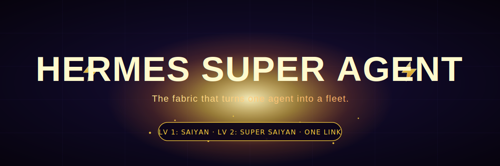
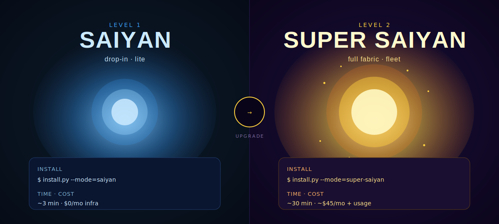

<!-- markdownlint-disable MD033 MD041 -->
<p align="center">
  
</p>

<p align="center">
  <a href="LICENSE"></a>
  <a href="#"></a>
  <a href="#"></a>
  <a href="https://github.com/jbellsolutions/hermes-super-agent/stargazers"></a>
</p>

<p align="center">
  <strong>Drop the link. Paste the prompt. Pick your power level.</strong><br/>
  Saiyan (lite, ~3 min) drops the planner + 14 runtimes into your existing Hermes.<br/>
  Kaioken (local full, ~10 min) brings up the entire fabric in Docker on your laptop.<br/>
  Super Saiyan 5 (cloud, ~30 min) deploys it all to Railway + DigitalOcean — always-on, public, team-shared.<br/>
  One repo. Three install modes. One share link.
</p>

<p align="center">
  <a href="#-pick-your-power-level">Pick your form</a> ·
  <a href="#-install-in-one-prompt">Install</a> ·
  <a href="#-how-it-decides">How it decides</a> ·
  <a href="#-how-it-works">How it works</a> ·
  <a href="QUICKSTART.md">Quickstart</a> ·
  <a href="INSTALL.md">Master prompt</a>
</p>

---

## ⚡ The 30-second pitch

You spun up a Hermes agent. It works. You ask it to do real work and it runs out of room.

It can't fan one task across 300 parallel sub-agents. It can't spawn its own teammates. It can't survive a reboot mid-job. It can't read a Slack thread, finish the work overnight on a fresh VPS, and ping you on Telegram when it's done.

You don't need a smarter model. You need a **fabric** underneath the agent that does all of that for you. That's what this is.

Same brain across every channel. Three execution lanes (in-process / fan-out / permanent spawn), each tier-gated. One Telegram bot to drive the whole fleet.

---

## 🟡 Pick your power level

<p align="center">
  
</p>

|  | **Saiyan** *(lite)* | **Kaioken** *(local full)* | **Super Saiyan 5** *(cloud)* |
|---|---|---|---|
| **For** | You already have a Hermes / Python agent project | You want the full fleet on your laptop | You want it always-on, public, team-shared |
| **Install command** | `install.py --mode=saiyan --target=YOUR_PROJECT` | `install.py --mode=kaioken` | `install.py --mode=super-saiyan-5` |
| **What lands** | Planner + 14 in-process runtimes + 16 SKILL.md files | Everything in Saiyan **+** NATS + Temporal + Coordinator + Admiral in Docker + spawning Tier 2 superagents as sibling containers | Everything in Kaioken **+** 5 Railway services + DigitalOcean Tier 2 spawning + public A2A endpoint |
| **New infrastructure** | None | Local Docker (4 containers) | 5 Railway services + on-demand DO droplets |
| **Cost floor** | $0 | $0 (Docker on your laptop) | ~$45/mo + ~$24/mo per active Tier 2 VPS |
| **Install time** | ~3 minutes | ~10 minutes (mostly Docker pull) | ~30 minutes |
| **Survives laptop sleep** | n/a | No | **Yes** |
| **Public webhook URL** | No | No | **Yes** |
| **Upgradable** | → Kaioken or → SS5 anytime | → SS5 (same compose, different host) | terminal — this is the full form |

When in doubt, **start Saiyan**. Free, 3 minutes, no infra. Step up to **Kaioken** when you want to actually spawn superagents. Step up to **Super Saiyan 5** when you want them to outlive your laptop.

---

## 🚀 Install in one prompt

Open Claude Code, Codex, or Cursor. Paste this. Done.

```text
Set up Hermes for me, A to Z, from
https://github.com/jbellsolutions/hermes-super-agent.

Step 1 — Hermes prereq.
  Ask me: "Do you have Hermes installed already?"
  - If NO: walk me through QUICKSTART.md to install Hermes.
  - If YES: skip to step 2.

Step 2 — Pick a power level.
  Ask me: "Saiyan, Kaioken, or Super Saiyan 5?"
  - Saiyan (lite, ~3 min): keep my Hermes; install just the planner +
    14 runtimes + 16 SKILL.md files. After, run examples/saiyan_hello.py.
  - Kaioken (local full, ~10 min, Docker required): full Hermes fabric
    on my laptop. NATS + Temporal + Coordinator + Admiral in Docker;
    spawns Tier 2 superagents as sibling containers. After, run
    examples/kaioken_spawn_demo.py.
  - Super Saiyan 5 (cloud, ~30 min, ~$45/mo): full Railway + DO fabric.
    Always-on, public A2A endpoint, team-shared. After, send "hello"
    to my Telegram bot.

Step 3 — Install. Use install.py for whichever mode I picked. Stream
output. Run the smoke test. Don't write code — I'll paste keys.
```

You paste keys. You don't write code. The agent handles every signup, every config, every smoke test.

Or run it yourself:

```bash
# Saiyan (lite — drop into your existing Hermes)
git clone https://github.com/jbellsolutions/hermes-super-agent /tmp/hsa
python3 /tmp/hsa/install.py --mode=saiyan --target=/path/to/your/project --yes

# Kaioken (local full — Docker fabric on your laptop)
git clone https://github.com/jbellsolutions/hermes-super-agent
cd hermes-super-agent && uv sync
cp .env.example .env   # add ANTHROPIC_API_KEY
python3 install.py --mode=kaioken --yes

# Super Saiyan 5 (cloud — Railway + DO fabric)
git clone https://github.com/jbellsolutions/hermes-super-agent
cd hermes-super-agent && uv sync
python3 install.py --mode=super-saiyan-5
```

Manual fallback walkthrough: [INSTALL.md](INSTALL.md). Mode deep-dive: [docs/modes.md](docs/modes.md).

---

## 💪 What you can do

Most days, you text Hermes:

```
research these 5 SaaS startups and tell me which is the strongest acquisition target
```

A brief lands a few minutes later. No new infrastructure spun up. One in-process LLM call, a couple of tool uses, done.

Some days:

```
run this RFP analysis 100 ways in parallel and give me the best three
```

The Coordinator service that's already deployed runs 100 parallel sub-agents, Temporal-wrapped so it survives a restart. Still no new infra.

Once in a while — maybe twice a quarter:

```
spin up a cold-email superagent with its own swarm coordinator and a phone agent
```

You get a Tier 3 plan card: `⚠ Permanent infra: provisions a NEW DigitalOcean VPS (~$5/mo recurring) running a full Hermes process until stopped.` You reply **`YES`**. Twelve minutes later: VPS online, full Hermes running, three sub-agents deployed, all heartbeating on NATS.

You go to bed. It runs the campaign. You wake up to a summary.

---

## 🧠 How it decides

This is an agent that runs a company. Most of the time, it does the work itself. Sometimes it outsources. Once in a while, it hires.

| | Lane | When | What it does | Cost |
|---|---|---|---|---|
| **🏃** | **Ephemeral sub-agent** *(~90%)* | "summarize this", "research these 3 startups", "draft an email" | Runs in-process via `hermes_self`. One LLM call, maybe a tool use, returns. | $0 incremental |
| **🎯** | **Outsourced fan-out** *(~8%)* | "do this 100 ways in parallel", "fan out across 50 leads" | Routes to the existing Coordinator service. N parallel calls, Temporal-wrapped. **No new infra.** | Existing Railway service |
| **👔** | **Permanent superagent** *(~2%)* | "spin up a cold email superagent", "hire a LinkedIn specialist" | Tier 3 hard stop. Plan card prints `⚠ Permanent infra`. After your **YES**: provisions NEW VPS or Railway service. | $5/mo each |

The intent classifier reads your wording before the planner runs and only adds spawn tags when the wording is unambiguous. *"Research X"* never accidentally provisions a VPS. *"Spin up a cold email superagent"* always asks for a `YES` and shows the recurring cost first.

---

## 🔥 How it works

Three open-source primitives. None of them new, none of them ours. The trick is what happens when you snap them together.

### 1. Google A2A Protocol — the universal language

Every agent in the fleet exposes three HTTP routes and one JSON file:

```
GET  /agentCard          → what I can do, what I cost, how to reach me
POST /messages           → here's a task, run it
GET  /tasks/{task_id}    → status: submitted → working → completed
```

Cards are self-describing. Admiral reads them at boot, builds a live capability map. Adding a new specialist (Hermes-based, Kimi-based, Agent Zero, Archon, anything that speaks A2A) does not require a code change in Admiral. It's just a new card.

### 2. NATS JetStream — the event bus

Every agent publishes to a namespaced subject:

```
agents.{id}.heartbeat
agents.{id}.task.started   .progress   .completed   .failed
agents.{id}.alert
fleet.commands.{id}
```

Admiral subscribes to `agents.>` (wildcard). State is live, not polled. JetStream persists, so a restart replays missed events and you never lose a fleet update. There's a circuit breaker in front of every publisher: a NATS outage degrades to "agents keep working, you just don't see them in real time" instead of "everything crashes."

### 3. Temporal — durable execution

The fan-out workflow is a Temporal workflow, not a best-effort coroutine. If your VPS reboots while 200 of 300 sub-agents are mid-flight, Temporal resumes from the last completed activity. No "did the job finish?" uncertainty.

That's the whole stack. NATS at $5/mo on Railway, Temporal at $15/mo on Railway, the rest is usage-billed. Floor is $45/mo total infra.

---

## 📦 What's in the box

Saiyan mode ships:

| | |
|---|---|
| **Planner stack** | tier_classifier · tool_planner · model_planner · plan_card · intent_classifier · catalog |
| **Override surface** | `/cancel /use <tool> /why /tier <N> YES` parsed in any channel |
| **14 in-process runtimes** | hermes_self · claude_subagents · codex_cli · aider · claude_managed · openclaw · openswarm · browser_use · agent_zero · computer_use · e2b · exa · livekit · terminal |
| **16 SKILL.md** | one frontmatter-tagged markdown file per tool, scored by the planner |
| **7 models** | Claude Opus 4.7 · Claude Sonnet 4.7 · Claude Sonnet 4.6 · GPT-5.5 · Kimi K2 · DeepSeek v4 Pro · Gemini 2.5 Pro |
| **3 identities** | COO · GTM · Head of Ops, with `tools_allowed` / `tools_denied` / `default_tier_ceiling` per role |
| **3 tunable configs** | `models.yaml` · `tiers.yaml` · `identities/*.yaml` — change without touching code |

Kaioken mode adds (all running in Docker on your laptop):

| | |
|---|---|
| **A2A FastAPI server** | `/agentCard` · `/messages` · `/tasks/{id}` (containerized Admiral on :8080) |
| **NATS JetStream bus** | publisher + subscriber, circuit-breaker'd |
| **Temporal durable workflows** | fan_out wrapped, crash-recoverable (UI at :8088) |
| **Coordinator service** | model-pluggable fan-out, runs as a container |
| **Local-spawn runtime** | spawns Tier 2 superagents as sibling Docker containers via the Docker SDK — same A2A contract as VPS spawning |
| **Telegram channel** | optional long-poll sidecar; no public URL needed |

Super Saiyan 5 mode adds (everything above, in the cloud):

| | |
|---|---|
| **Public A2A endpoint** | `https://<your-app>.up.railway.app/agentCard` — discoverable on the open agent web |
| **Always-on Railway services** | 5 services survive your laptop sleeping; cron jobs run overnight |
| **Real VPS spawning** | DigitalOcean droplet + SSH bootstrap of full Hermes + Claude Code + Codex + Aider |
| **Archon agent builder** | natural-language → AGENT.md + Railway service in ~15 min |
| **Outbound channels** | Retell AI phone + Instantly.ai email, both Tier 3 by default |
| **Dedicated outbound IP** | static droplet IPs you can warm for email reputation / PSTN allow-lists |
| **Team-shared inbox** | identity packs route by Telegram sender ID; one Admiral, many humans |
| **AgentOps observability** | auto-instruments LLM calls across all 7 backends, stable hostname |
| **Survives laptop death** | state is in the cloud — `git clone && uv sync` and you're back at full power |

---

## 🛡️ Tier-gated UX

| Tier | When | What happens |
|---|---|---|
| **1** | Read-only, cheap, idempotent | One-line banner: `⚡ using openswarm · claude-opus-4.7` |
| **2** | Mutates / substantive | 4-line plan card, reply `yes` to run, or `/use <tool>` `/why` `/cancel` |
| **3** | Destructive · public · spawn · outbound · >$1 | Hard stop. Reply uppercase `YES` to proceed. |

Override commands work in any channel:

| Command | Effect |
|---|---|
| `/cancel` | Abort the pending plan |
| `/use <tool> [<model>]` | Swap the runtime (and optionally the model) |
| `/why` | 5-line rationale: tools scored, signals fired, model picked |
| `/tier <1\|2\|3>` | Force this task to a tier |
| `YES` (uppercase) | Confirm a Tier 3 |

---

## 💰 Cost

| | Monthly |
|---|---|
| Railway (5 services: NATS, Temporal, Coordinator, Archon, Admiral) | ~$40 |
| Anthropic API (light usage) | $5–50 |
| Tier 2 superagent VPSes | $5/mo each, only when spawned |
| Retell phone | $0.05/min when calling |
| Instantly email | per-campaign |
| AgentOps | free tier covers most usage |
| **Floor** | **~$45/mo** |

Hard caps in code: `COORDINATOR_MAX_SUBTASKS=300` and `COORDINATOR_MAX_RETAINED=1000` so a hostile or confused prompt can't melt your bill. Cost guardrails fire a NATS alert at 80% of `DAILY_COST_CAP_USD` and hard-block at 100%.

---

## 🎯 Status

Shipped. **337 unit + smoke + integration tests passing.**

Recent fix bundles, each with its own contract tests:

- **Loop 21** — three lanes (ephemeral / fan-out / permanent spawn), intent classifier, permanent-infra warnings
- **Loop 20** — A2A `_dispatch_task` actually calls `dispatch()`; planner output flows through; lite-mode dispatch trim; admiral/worker role split via `HERMES_ROLE`
- **Loop 17–19** — unbounded growth caps, orphan VPS cleanup, full `hermes_self` runtime
- **Loops 4–16** — bootstrap entrypoint, registry locking, NATS circuit breaker, cost ceilings, security gate

What's intentionally manual: the auto-update daemon and quality-flywheel cron live in code but are opt-in. The self-healing loop's auto-fix step from the genome library is on the next milestone. We don't claim "self-X" capabilities the system doesn't actually run on its own.

---

## ❓ FAQ

**Do I need to install Hermes first separately?**
No. This repo IS the Hermes install. Kaioken brings up the full Hermes stack in Docker on your laptop. Super Saiyan 5 brings it up on Railway. Saiyan is for people who already have *some* Python agent project they want to layer the planner onto.

**Will it spawn a VPS just because I asked it to do work?**
No. Pure natural-language prompts ("research X", "summarize Y") never auto-spawn anything. Permanent-infra spawning fires only on explicit phrases like *"spin up"*, *"hire"*, *"create a permanent X"* — and even then it's gated behind a Tier 3 plan card with a recurring-cost warning, requiring uppercase `YES`.

**Can I use my own model?**
Yes. `config/models.yaml` registers seven models out of the box, plus an OpenRouter fallback that takes any `vendor/model` id. The model planner is rule-based and deterministic — no LLM call to pick the model.

**What if Saiyan mode's smoke test fails because pyyaml isn't installed?**
The installer offers to `pip install` (or `uv sync`) the missing deps inline and then re-runs the real smoke test against `examples/saiyan_hello.py`. If `--yes` is set, it just installs without asking. If you decline, it prints the exact follow-up command.

**Can I upgrade Saiyan → Kaioken → Super Saiyan 5 later?**
Yes, idempotent. The modes are additive. Saiyan installs in your project; Kaioken brings up Docker; SS5 deploys to Railway. You can run all three at once if you want — point your Saiyan project at Kaioken's Admiral via `HERMES_ADMIRAL_A2A=http://localhost:8080`, or at SS5's via the Railway URL.

**Can I run Kaioken without an internet connection?**
Mostly yes. The fabric is local. LLM calls (Anthropic, OpenAI, etc.) still need the internet. If you set up a local LLM via OpenRouter or Ollama you can run fully offline.

**Two repos or one?**
One. Splitting later is reversible. Pre-splitting now is friction without benefit. See `vault/decisions/` for the full reasoning.

**Why DBZ-themed names?**
Because *Saiyan*, *Kaioken*, and *Super Saiyan 5* describe the actual difference: base form, temporary local power-up, ultimate cloud form. `lite`, `full`, and `super-saiyan` work as aliases if you'd rather type those.

---

## 🛠️ Hard rules

- **Never edit `vendor/`.** Open an upstream PR or wrap in `src/agent_os/runtimes/`.
- **Never start another framework wrapper.** New ideas land as runtime adapters, Hermes skills, or upstream PRs.
- **Single-state guarantee.** Every channel writes through the vault adapter. No per-channel state.
- **Default to Hermes.** Specialist runtimes are exceptions, not defaults. The planner enforces this.
- **Tier 3 always asks for `YES`.** No exceptions, no autopilot, no "the user said yes once last week."

---

## 📚 Deeper docs

| | |
|---|---|
| [QUICKSTART.md](QUICKSTART.md) | ~30 min Super Saiyan 5 deploy |
| [INSTALL.md](INSTALL.md) | The master prompt + manual fallback for both modes |
| [docs/modes.md](docs/modes.md) | Saiyan vs Kaioken vs Super Saiyan 5 — deep-dive on what's in each, when to pick which, upgrade paths |
| [docs/working-with-this-repo.md](docs/working-with-this-repo.md) | Contributor workflow: log entries, safety-scan, safe-publish |
| [ARCHITECTURE.md](ARCHITECTURE.md) | A2A + NATS + Temporal contracts, dispatch flow, planner internals |
| [STORY.md](STORY.md) | The 14 frameworks this replaced |
| [ETHOS.md](ETHOS.md) | The rules that keep it from sprawling again |
| [SECURITY.md](SECURITY.md) | Secret model, threat surface, disclosure address |
| [docs/tool-awareness-handoff.md](docs/tool-awareness-handoff.md) | Tool catalog + planner internals (the layer Saiyan ships) |
| `vault/decisions/` | Every non-obvious choice, with rationale and the alternative considered |

---

## ⭐ Star this repo

If this saved you a week of building durable execution + multi-agent fan-out + a tier-gated planner from scratch, hit the star. It's free and helps other builders find it.

[](https://star-history.com/#jbellsolutions/hermes-super-agent&Date)

---

## License + credits

MIT. Use it, fork it, ship it.

Built by [Justin Bell](https://github.com/jbellsolutions). Architecture-review credits in `vault/decisions/`. The DBZ flavor is homage, not affiliation — Dragon Ball is © Toei Animation / Akira Toriyama. The artwork in `assets/` is original SVG (no copyrighted imagery).

Security disclosures: [SECURITY.md](SECURITY.md).
