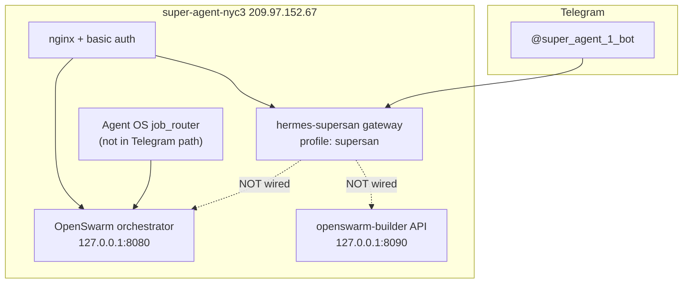

# SuperAgent + OpenSwarm — canonical ops reference

**Purpose:** Single source of truth for any agent (human or AI) assessing, operating, or updating the live SuperAgent stack. Read this file first before changing infrastructure.

**Last verified:** 2026-06-07 (VPS SSH + service checks)

**Maintainer:** Update this file whenever VPS layout, integration status, or public URLs change. After edits, bump `Last verified` and run the verification block at the bottom.

---

## One-line map

| Surface | What you get | OpenSwarm-aware? |
|---------|--------------|------------------|
| **Telegram `@super_agent_1_bot`** | Hermes gateway — portfolio operator (Kimi) | **No** (not wired yet) |
| **Web `/openswarm-chat/`** | Direct OpenSwarm orchestrator chat | **Yes** |
| **Web `/` Hermes dashboard** | Web UI; `/chat` API is stub — not production | **No** |
| **Agent OS `job_router`** | Routes `swarm` / `openswarm` tags → OpenSwarm runtime | **Yes** (code path exists; not used by Telegram gateway) |
| **Builder API `:8090`** | Design → approve → build new swarms | **Yes** (localhost on VPS) |

---

## GitHub repos (canonical)

| Repo | URL | Role |
|------|-----|------|
| **hermes-super-agent** | https://github.com/jbellsolutions/hermes-super-agent | SuperAgent + Agent OS; **this doc lives here** |
| **openswarm-builder** | https://github.com/jbellsolutions/openswarm-builder | Standalone swarm factory (HTTP API, MCP, portable skill) |

**Deploy on VPS:** Always pull `hermes-super-agent` `main` to `/home/claw/hermes-super-agent`. Builder clone at `/home/claw/openswarm-builder`.

---

## Primary host (only SuperAgent VPS)

| Field | Value |
|-------|--------|
| Droplet | **super-agent-nyc3** (DigitalOcean ID `570862075`) |
| Public IP | **209.97.152.67** |
| Region | NYC3 |
| Tags | `super-agent`, `super-saiyan` |
| SSH | `ssh root@209.97.152.67` (app user: **`claw`**) |
| **Not this stack** | `single-brain` (104.236.11.200), other DO droplets |

There is **no second Agent OS SuperAgent VPS** in DigitalOcean — only this droplet.

---

## Architecture (three surfaces today)



**Why Telegram “doesn’t know” OpenSwarm:** The gateway runs `hermes --profile supersan gateway run`. It does **not** call Agent OS `job_router` or OpenSwarm HTTP unless skills/tools are added to the live profile. OpenSwarm env vars exist in Hermes `.env` but are unused by the gateway today.

---

## Telegram SuperAgent

| Field | Value |
|-------|--------|
| Bot name | Super Agent 1 |
| Username | **`@super_agent_1_bot`** |
| Bot ID | `7991833249` |
| Home chat (Justin) | `telegram:1264488761` |
| Mode | Long polling (webhook URL empty) |
| Model | `moonshotai/Kimi-K2.6` via Together (`custom` provider) |
| Service | `systemctl --user -M claw@ status hermes-supersan` |
| Start script | `/home/claw/hermes-super-agent/scripts/start.sh` |

### Live identity & config

| Path | Purpose |
|------|---------|
| `/home/claw/.hermes/profiles/supersan/SOUL.md` | Personality + capabilities (**no OpenSwarm section on VPS yet**) |
| `/home/claw/.hermes/profiles/supersan/config.yaml` | Gateway config |
| `/home/claw/.hermes/profiles/supersan/.env` | `TELEGRAM_BOT_TOKEN`, allowed users |
| `/home/claw/.hermes/profiles/supersan/skills/` | **Gateway skills** (github, notion, etc.) — **no openswarm skill symlinked here** |
| `/home/claw/.hermes/profiles/supersan/sessions/` | Conversation sessions |
| `/home/claw/.hermes/profiles/supersan/logs/agent.log` | Inbound/outbound message log |

### Repo vault skills (NOT auto-loaded by Telegram)

| Path | Purpose |
|------|---------|
| `/home/claw/hermes-super-agent/vault/skills/active/tools/openswarm.md` | Agent OS / Hermes routing skill |
| `/home/claw/hermes-super-agent/vault/skills/active/tools/openswarm-builder.md` | Builder design→approve→build skill |

Portable builder skill (any host): https://github.com/jbellsolutions/openswarm-builder/blob/main/adapters/skill/SKILL.md

---

## Public URLs (HTTP basic auth)

| URL | Purpose |
|-----|---------|
| http://209.97.152.67/ | Hermes web dashboard (`/chat`, `/voice`) |
| http://209.97.152.67/openswarm-chat/ | **Bookmarkable OpenSwarm chat** (talks to orchestrator) |
| http://209.97.152.67/openswarm/docs | OpenSwarm Swagger (via nginx proxy) |
| http://209.97.152.67/openswarm/open-swarm/get_metadata | Orchestrator metadata |

**Auth**

| Field | Value |
|-------|--------|
| Username | `hermes` |
| Password | `ytih8vkvxhZfvVwB` (also in `/home/claw/.hermes/dashboard_pass.txt` on VPS) |
| nginx htpasswd | `/etc/nginx/.htpasswd` |

**Localhost-only (SSH tunnel from laptop)**

| URL | Purpose |
|-----|---------|
| `http://127.0.0.1:8090/health` | Builder API health |
| `http://127.0.0.1:8080/open-swarm/get_response` | Orchestrator chat API |
| `http://127.0.0.1:8642` | Hermes gateway api_server (profile) |

---

## Paths on VPS

| Path | Purpose |
|------|---------|
| `/home/claw/hermes-super-agent` | Hermes SuperAgent repo (git) |
| `/home/claw/hermes-super-agent/src/agent_os` | Agent OS module + `job_router` |
| `/home/claw/.hermes/hermes-agent` | Hermes gateway install + venv |
| `/home/claw/.hermes/hermes-agent/.env` | Shared secrets (API keys, OpenSwarm URLs) |
| `/home/claw/openswarm-builder` | Builder API clone |
| `/home/claw/.agent-os/swarms/` | Hermes fleet swarms (orchestrator data) |
| `/home/claw/.openswarm/` | Builder fleet + specs |
| `/var/www/openswarm-chat/index.html` | Static OpenSwarm chat UI |

---

## Services

| Service | Unit | Port / notes |
|---------|------|----------------|
| Hermes gateway (Telegram/Slack) | `hermes-supersan.service` (user) | `hermes --profile supersan gateway run` |
| Hermes webapp | `hermes-webapp.service` (user) | `9119` |
| OpenSwarm default orchestrator | `openswarm-default.service` (user) | **`8080`** — `POST /open-swarm/get_response` |
| OpenSwarm Builder API | `openswarm-builder-api.service` (system) | **`8090`** — localhost only |

### Restart commands (run as `claw` unless noted)

```bash
# Telegram / Slack gateway
systemctl --user restart hermes-supersan

# OpenSwarm orchestrator
systemctl --user restart openswarm-default

# Builder API (system)
sudo systemctl restart openswarm-builder-api

# Hermes web UI
systemctl --user restart hermes-webapp
```

---

## OpenSwarm API (orchestrator on 8080)

**Correct chat endpoint:** `POST /open-swarm/get_response` (not `get_completion`)

```bash
curl -s http://127.0.0.1:8080/open-swarm/get_response \
  -H 'Content-Type: application/json' \
  -d '{"messages":[{"role":"user","content":"ping"}],"stream":false}'
```

**Model on VPS swarm:** `anthropic/claude-sonnet-4-5` (uses `ANTHROPIC_API_KEY` from Hermes `.env`)

**Chat UI:** `/var/www/openswarm-chat/index.html` must call `get_response` — fixed 2026-06-06.

**Hermes HTTP client:** `src/agent_os/runtimes/openswarm/http_client.py` must use `get_response`.

---

## OpenSwarm Builder API (8090)

```bash
curl -s http://127.0.0.1:8090/health
# {"status":"ok","pending_approvals":N,"swarms":N}
```

Env on VPS (in Hermes `.env`):

- `OPENSWARM_BUILDER_URL=http://127.0.0.1:8090`
- `OPENSWARM_HOME=/home/claw/.openswarm`

**Pending approval (as of last check):** spec `minimal-test-swarm` may still await approval — check `GET /specs` or health `pending_approvals`.

---

## Agent OS routing (for non-Telegram dispatch)

File: `src/agent_os/orchestrator/adapters/job_router.py`

Tags that route to **`openswarm`** runtime:

- `swarm`, `openswarm`
- `build-swarm`, `new-swarm`
- `multi-deliverable`, `slides+research+docs`, `investor-pitch`, `pitch-deck`

Identity config: `src/agent_os/orchestrator/config/identities/supersan.yaml`

**Important:** Telegram gateway does **not** use this router unless explicitly integrated.

---

## Integration status checklist

Use this to assess “is SuperAgent + OpenSwarm unified?”

| Item | Status | Fix |
|------|--------|-----|
| OpenSwarm orchestrator running | ✅ | `systemctl --user status openswarm-default` |
| Builder API running | ✅ | `systemctl status openswarm-builder-api` |
| Web OpenSwarm chat working | ✅ | `/openswarm-chat/` + auth |
| Telegram bot connected | ✅ | `@super_agent_1_bot` polling |
| Telegram knows OpenSwarm | ❌ | Wire skills + SOUL + HTTP tools (see below) |
| VPS SOUL mentions OpenSwarm | ❌ | Update `/home/claw/.hermes/profiles/supersan/SOUL.md` |
| Gateway skills include openswarm | ❌ | Symlink/copy vault skills into profile `skills/` |
| Hermes web `/chat` production-ready | ❌ | `packages/webapp/app/api/hermes/route.ts` is stub |
| Slack gateway | ❌ | `invalid_auth` — rotate tokens in `.env` |
| Telegram ↔ OpenSwarm session | ❌ | Optional: bridge or reset broken session (Jun 3 truncation) |

---

## How to wire OpenSwarm into Telegram (standard procedure)

Execute on VPS as `claw` after pulling latest `hermes-super-agent`:

1. **Update SOUL** — Add OpenSwarm + builder URLs and when to use them to `~/.hermes/profiles/supersan/SOUL.md` (or sync from repo if template added).

2. **Install gateway skills**
   ```bash
   ln -sf /home/claw/hermes-super-agent/vault/skills/active/tools/openswarm.md \
     ~/.hermes/profiles/supersan/skills/openswarm/SKILL.md
   ln -sf /home/claw/hermes-super-agent/vault/skills/active/tools/openswarm-builder.md \
     ~/.hermes/profiles/supersan/skills/openswarm-builder/SKILL.md
   ```
   (Create parent dirs if Hermes expects `skills/<name>/SKILL.md` layout — match existing skill folder pattern.)

3. **Confirm env** in `/home/claw/.hermes/hermes-agent/.env`:
   - `OPENSWARM_BUILDER_URL=http://127.0.0.1:8090`
   - `OPENSWARM_ORCHESTRATOR_URL=http://127.0.0.1:8080` (add if missing)
   - Valid `ANTHROPIC_API_KEY` for orchestrator swarm `.env`

4. **Wire Hermes native tools** (if present in repo): `openswarm_builder/integrations/hermes/tools.py` → gateway tool registration per Hermes docs.

5. **Restart gateway:** `systemctl --user restart hermes-supersan`

6. **Verify:** Message `@super_agent_1_bot`: “What is OpenSwarm and can you invoke it?” — should describe stack and attempt tool/HTTP call.

---

## Deploy / update procedure

### Pull latest on VPS

```bash
ssh root@209.97.152.67
sudo -u claw -i
cd ~/hermes-super-agent && git fetch origin && git checkout main && git pull --ff-only
cd ~/openswarm-builder && git fetch origin && git pull --ff-only
# Restart affected services (see above)
```

### Local dev copies (may diverge from VPS)

| Location | Notes |
|----------|--------|
| `~/Desktop/Hermes Super Agent` | Often **ahead/behind** `origin/main` — **not auto-deployed** |
| VPS `/home/claw/hermes-super-agent` | **Live** Telegram + Agent OS |

Always treat **VPS git HEAD** as production truth unless you explicitly deploy from local.

---

## Known issues & fixes

| Issue | Root cause | Fix |
|-------|------------|-----|
| Telegram doesn’t know OpenSwarm | Gateway not wired to OpenSwarm | Integration checklist above |
| OpenSwarm chat 404 | UI called `get_completion` | Use `get_response` in chat HTML |
| OpenSwarm 500 | Empty/wrong API keys in swarm `.env` | Sync `ANTHROPIC_API_KEY`; set `DEFAULT_MODEL=anthropic/claude-sonnet-4-5` |
| Telegram 48-char truncated replies | Long session / output limits (Jun 2026) | Reset session in `~/.hermes/profiles/supersan/sessions/` or `/newchat` if supported |
| Slack dead | `invalid_auth` | Fresh `SLACK_BOT_TOKEN` + `SLACK_APP_TOKEN` in profile `.env` |
| `openswarm-builder` git on VPS | dubious ownership | `git config --global --add safe.directory /home/claw/openswarm-builder` (as claw) |

---

## Security notes

- This document contains **operational credentials** for a private infrastructure stack. Keep repo access restricted.
- OAuth-style AI tokens (`tgp_v1_...`) are **not** valid as OpenAI API keys for OpenSwarm orchestrator — use provider-appropriate keys.
- Port **8080** should stay off public internet; nginx proxies `/openswarm/` with auth. Confirm UFW.

---

## Verification (run after any change)

```bash
# From laptop
ssh root@209.97.152.67 'bash -s' <<'EOF'
set -e
echo "=== git ==="
sudo -u claw git -C /home/claw/hermes-super-agent rev-parse --short HEAD
echo "=== services ==="
systemctl is-active openswarm-builder-api
systemctl --user -M claw@ is-active hermes-supersan openswarm-default hermes-webapp
echo "=== health ==="
curl -sf http://127.0.0.1:8090/health
curl -sf http://127.0.0.1:8080/open-swarm/get_metadata | head -c 200
echo
echo "=== telegram bot ==="
source /home/claw/.hermes/profiles/supersan/.env
curl -sf "https://api.telegram.org/bot${TELEGRAM_BOT_TOKEN}/getMe" | python3 -c "import sys,json; r=json.load(sys.stdin)['result']; print(r['username'], r['first_name'])"
EOF
```

**Expected:** all services `active`, health OK, bot `super_agent_1_bot Super Agent 1`.

---

## Related docs

| Doc | URL |
|-----|-----|
| **This file (canonical)** | https://github.com/jbellsolutions/hermes-super-agent/blob/main/docs/SUPERAGENT_STACK.md |
| Hermes hosts (short) | https://github.com/jbellsolutions/openswarm-builder/blob/main/deploy/HERMES_HOSTS.md |
| Builder portable skill | https://github.com/jbellsolutions/openswarm-builder/blob/main/adapters/skill/SKILL.md |
| Agent OS job router | https://github.com/jbellsolutions/hermes-super-agent/blob/main/src/agent_os/orchestrator/adapters/job_router.py |

---

## Quick answers for agents

**Q: Where is the SuperAgent?**  
A: VPS `209.97.152.67`, Telegram `@super_agent_1_bot`, Hermes profile `supersan`.

**Q: Where is OpenSwarm?**  
A: Same VPS — orchestrator `:8080`, builder `:8090`, web chat http://209.97.152.67/openswarm-chat/

**Q: Why doesn’t Telegram know OpenSwarm?**  
A: Separate code paths; integration checklist not completed.

**Q: What should I read before editing infra?**  
A: This file, then SSH verify, then change, then run Verification block.
